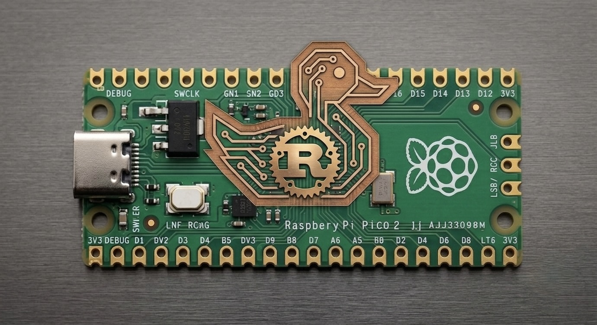

# Pico Bit

`pico-bit` is a MicroPython DuckyScript runtime for the Raspberry Pi Pico 2 W (`RPI_PICO2_W`) only. It runs a USB HID keyboard payload from `payload.dd`, starts a Wi-Fi injector portal, and keeps the payload editable on the device.

## What It Does

- runs `payload.dd` as a keyboard payload
- starts a Wi-Fi access point and browser injector on every boot
- lets you view, edit, save, and run the payload from a phone or laptop
- seeds `payload.dd` automatically on first boot if the file is missing

## Hardware

- Supported board: Raspberry Pi Pico 2 W (`RPI_PICO2_W`) only
- Other Pico 2 variants are not supported by this project
- Use the Pico's own USB data port for HID, not a carrier-only power port

## Default Access

- AP SSID: `PicoBit`
- AP password: `88888888`
- Portal URL: `http://192.168.4.1`
- Portal username: `admin`
- Portal password: `88888888`

## Download Firmware

Download the latest `.uf2` from the GitHub Releases page:

- Latest release: <https://github.com/anapeksha/pico-bit/releases/latest>
- All releases: <https://github.com/anapeksha/pico-bit/releases>

Look for the release asset named like `pico-bit-RPI_PICO2_W-<version>.uf2`.

## Flash The Board

1. Hold `BOOTSEL` while connecting the Pico to your computer.
2. Copy the downloaded `.uf2` file to the `RPI-RP2` drive.
3. Wait for the board to reboot.

On first boot, Pico Bit creates `payload.dd` automatically if it is not already present.

## Use The Injector

1. Power the board from the Pico USB port.
2. Join the Wi-Fi network `picoBit`.
3. Open `http://192.168.4.1`.
4. Sign in with the default portal credentials.
5. Edit the payload, then save it or run it from the page.

The payload also runs automatically during boot once USB HID is ready.

## Payload File

- The active payload file is `payload.dd`
- It stays writable on the board filesystem
- Changes made in the browser are saved back to that file

## Safety

Use Pico Bit only on systems you own or are explicitly authorized to administer.

## License

This project is licensed under GPL-3.0-only. See `LICENSE`.
